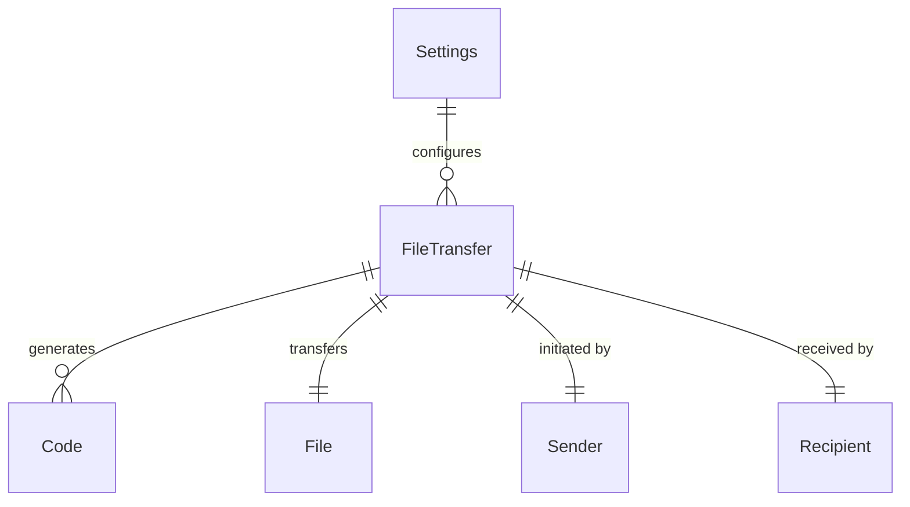

# Domain Model — L2

## Entities

### FileTransfer
- **Attributes**: `code`, `fileName`, `fileSize`, `direction` (send/receive), `status` (pending/active/completed/failed)
- **Invariants**: status transitions are linear (pending → active → completed/failed)
- **Aggregate root**

### Code
- **Value Object**
- **Attributes**: `value` (string), `version` (int)
- **Invariants**: must match the pattern `WORD-NUMBER-WORD`

### Settings
- **Entity** (persisted)
- **Attributes**: `rendezvousUrl`, `transitUrl`, `appearance`
- **Aggregate root**

## ERD

## Invariants

1. A `Code` can only be used for one transfer attempt
2. File transfer status must follow: `pending → active → completed | failed`
3. Settings changes take effect on the next transfer, not during an active one
