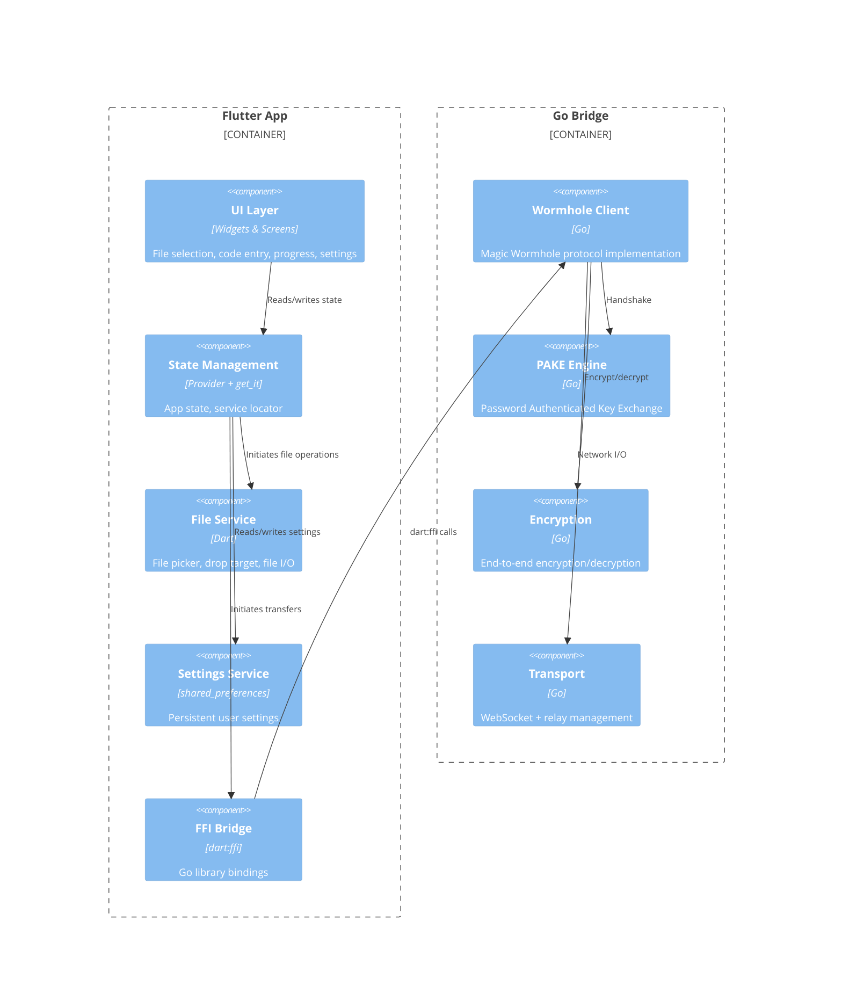

# Components

## Key Components

- **UI Layer** — Flutter widgets organized by screen (send, receive, settings, intro)
- **State Management** — `Provider` for reactive state, `get_it` for service location
- **FFI Bridge** — Dart FFI bindings to the Go shared library
- **Wormhole Client** — the core protocol implementation from `dart_wormhole_william`
