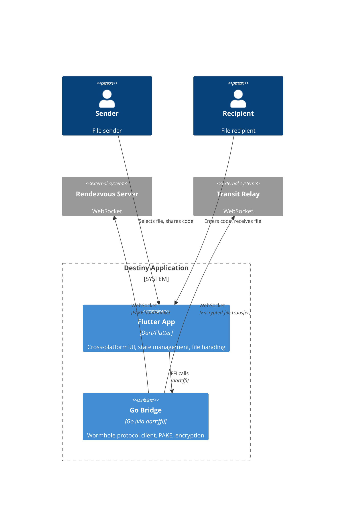

# Containers

## Container Descriptions

- **Flutter App** — the cross-platform UI layer. Handles file selection, code entry, progress display, settings, and platform integration (clipboard, permissions, notifications).
- **Go Bridge** — the wormhole-william Go client compiled as a shared library and accessed via Dart FFI. Handles the Magic Wormhole protocol: PAKE handshake, key derivation, encryption/decryption, and transit relay connections.
