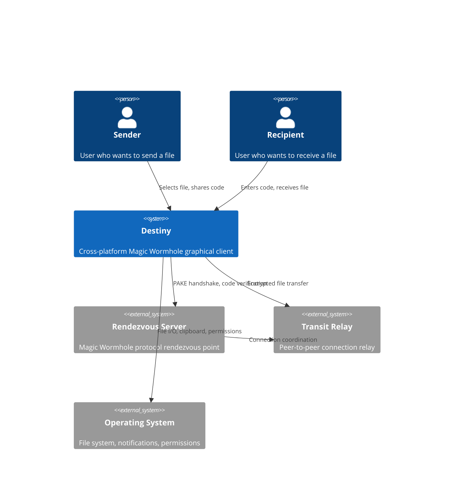

# System Context

## Actors

- **Sender** — selects a file, gets a short human-memorable code, shares it with the recipient
- **Recipient** — enters the code, receives the end-to-end encrypted file

## External Systems

- **Rendezvous Server** — coordinates the PAKE (Password Authenticated Key Exchange) handshake
- **Transit Relay** — relays encrypted packets when direct P2P connection is not possible
- **Operating System** — file system access, clipboard, permissions, notifications
